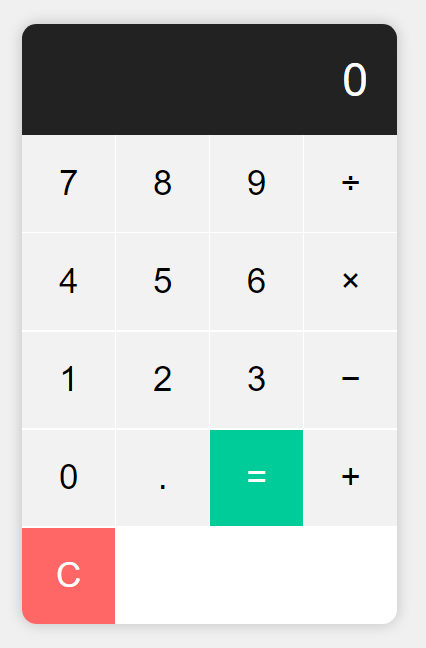

# Calculator App

A simple calculator application built using **HTML**, **CSS**, and **JavaScript**. This project allows users to perform basic arithmetic operations such as addition, subtraction, multiplication, and division.

## Features

- Perform basic arithmetic operations: addition, subtraction, multiplication, and division.
- Clear the current input and reset the calculator.
- Display results in real-time as you input numbers and operators.

## Demo



## Folder Structure

```bash
calculator-app/
├── index.html               # The main HTML file
├── css/
│   └── styles.css           # Custom CSS for styling the app
├── js/
│   └── app.js               # Main JavaScript file for the app
├── assets/
│   └── images/              # (Optional) Folder for storing images
│       └── calculatorUI.png # Example of an image (can be removed)
└── README.md                # Documentation of the project
```

## Getting Started

Follow the instructions below to clone and run the project locally.

### Prerequisites

- A web browser (Chrome, Firefox, etc.).
- Internet connection (only for cloning the project from GitHub).

### Installation

1. **Clone the repository**:
   
   Open your terminal or command prompt and run the following command to clone the repository from GitHub:

   ```bash
   git clone https://github.com/Abdullah-Al-Sobail/calculator-app.git
   ```

2. **Navigate to the project folder**:

   ```bash
   cd calculator-app
   ```

3. **Open the project in a web browser**:

   Simply open the `index.html` file in your preferred web browser. You can do this by:

   - Double-clicking on the `index.html` file in the project folder.
   - Or, using the command below (if you have Python installed):

     ```bash
     python -m http.server
     ```

     This will start a local server, and you can view the app by opening `http://localhost:8000` in your browser.

## Usage

- Click on the number buttons to input numbers.
- Click on the operator buttons to select the desired operation.
- Click the "=" button to calculate and display the result.
- Click the "clear" button to reset the calculator.

## Project Preview


## Technologies Used

- **HTML5**: For creating the structure of the app.
- **CSS3**: For styling the UI.
- **JavaScript**: For adding interactivity and handling calculations.

## License

This project is licensed under the MIT License - see the [LICENSE](LICENSE) file for details.

## Contributing

If you'd like to contribute to this project, please follow these steps:

1. Fork the repository.
2. Create a new branch (`git checkout -b feature-branch`).
3. Make your changes and commit them (`git commit -m "Add new feature"`).
4. Push to the branch (`git push origin feature-branch`).
5. Open a Pull Request.

## Contact

For any questions or feedback, feel free to reach out:

- **GitHub**: [Abdullah-Al-Sobail](https://github.com/Abdullah-Al-Sobail)
- **Email**: abdullahalsobail78@gmail.com


### Key Sections:

- **Project Overview**: A brief introduction to the project and its functionality.
- **Folder Structure**: Explanation of the files and directories in the project.
- **Getting Started**: Step-by-step guide on how to clone, install, and run the app locally.
- **Usage**: Instructions on how to use the calculator app.
- **Contributing**: Guidelines on how to contribute to the project.

